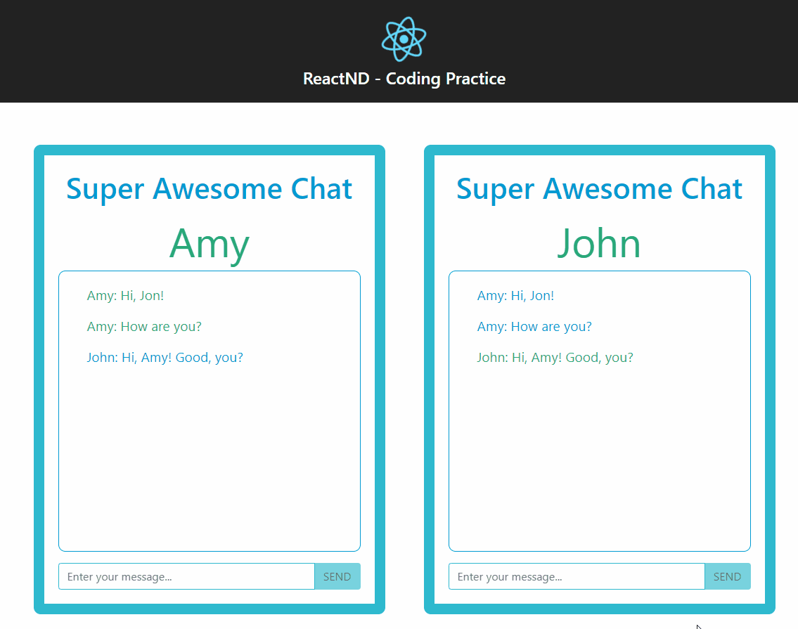

# Super Awesome Chat

Chat application built with React as an exercise of my React Nanodegree at Udacity.




## Installation

```
npm install
```

## Run

```
npm start
```

## Wireframe


## Class Diagram


